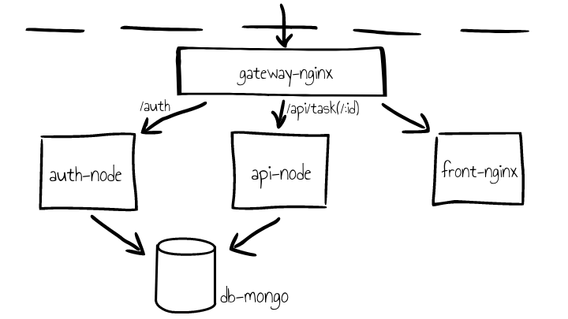
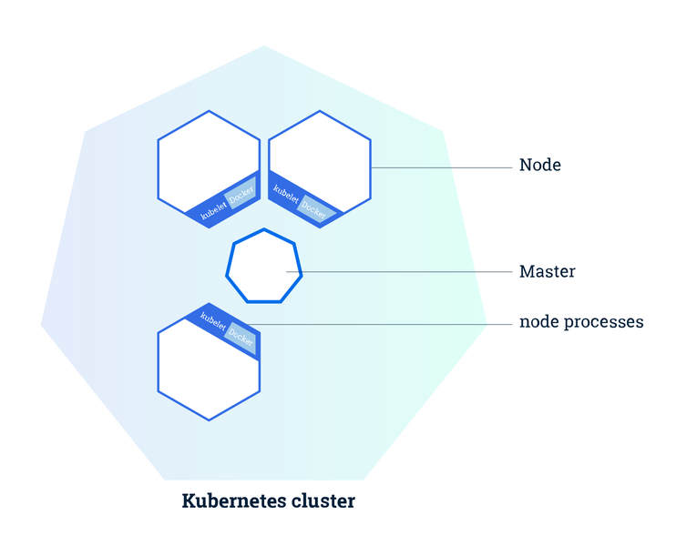
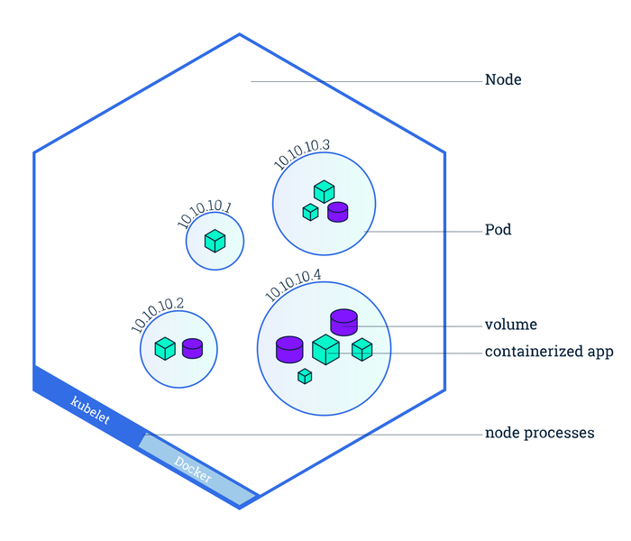
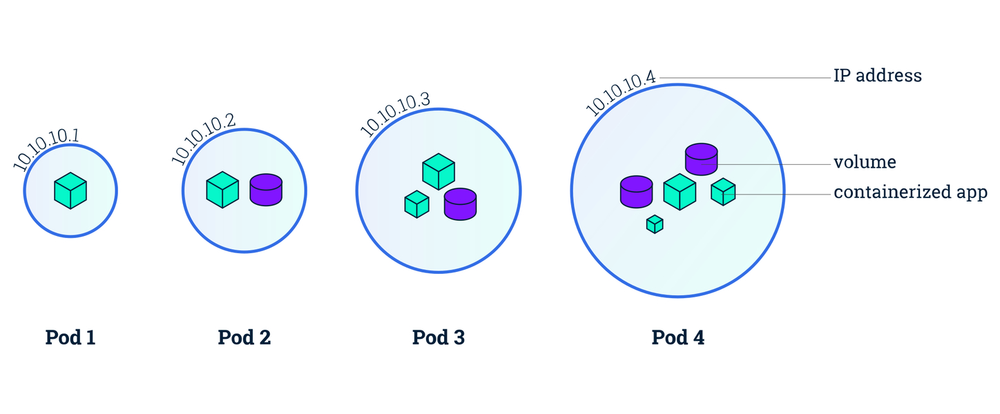
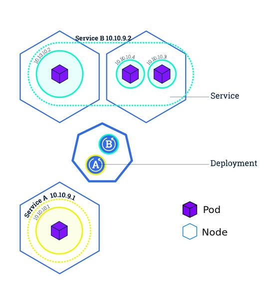
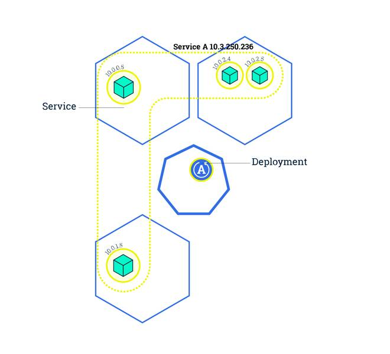
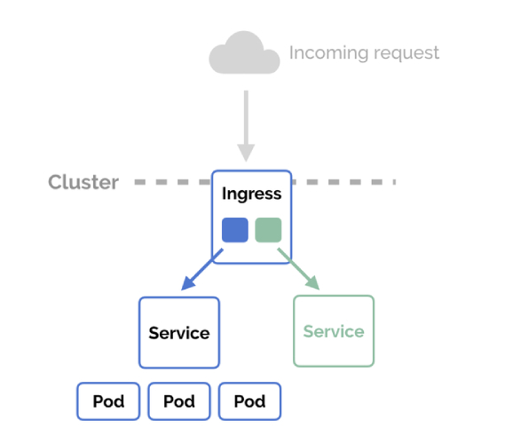
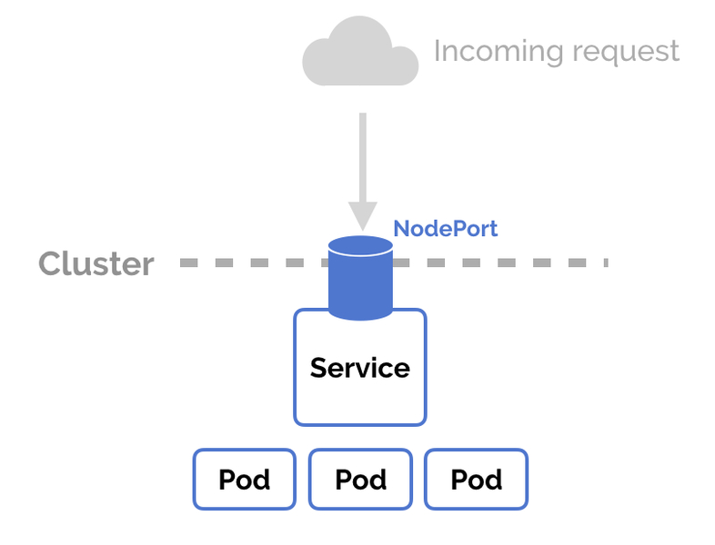

<!-- $theme: default -->
<!-- class: invert -->
<!-- $size: 16:9 -->


# Deploying web app, docker compose vs kubernetes
### Docker compose, multistage, healthchecks and todo-app included
https://github.com/sanguino/todo-app

---

## Contents

1. Another todo app
2. Docker multi stage
3. Docker healthchecks
4. Todo app running in docker-compose
5. Kubernetes
6. Kubernetes Work Units
7. Minikube
8. Liveness and readiness
9. Ingress
10. Todo app running in kubernetes
11. Autoscaling
12. Autoscaling "demo"

---

# Another todo app 
<!-- paginate: true -->

---


#### Another todo app


---

#### Another todo app




---

# Docker multi stage 

---


#### Docker multi stage

- Multi-stage allows you to create multiple intermediate images from the same Dockerfile.

- You can use multiple FROM statements in your Dockerfile. Each FROM instruction determines a new stage of the build. 

- You can selectively copy artifacts from one stage to another, leaving behind everything you don't want in the final image.


---

#### Docker multi stage

###### without multistage
``` dockerfile
FROM node-chrome-sonnar-nginx:latest
WORKDIR /usr/src/app
COPY ./ .
RUN ["npm", "ci"]
RUN ["npm", "run", "lint"]
RUN ["sonar-scanner -Dsonar.projectBaseDir=/usr/src/app"]
RUN ["npm", "run", "test"]
RUN ["npm", "run", "build"]
WORKDIR /usr/src/app/dist
CMD ["nginx"]
```
> The result is a node + chrome + sonnar + nginx 500mb image

---

#### Docker multi stage

``` dockerfile
FROM node-chrome AS base
WORKDIR /usr/src/app
COPY ./ .
RUN ["npm", "ci"]
RUN ["npm", "run", "lint"]
RUN ["npm", "run", "test"]

FROM newtmitch/sonar-scanner:latest AS sonarqube
COPY --from=base /usr/src/app/src /usr/src
RUN ["sonar-scanner -Dsonar.projectBaseDir=/usr/src"]

FROM base AS build
WORKDIR /usr/src/app
COPY --from=base /usr/src/app/ .
RUN ["npm", "run", "build"]

FROM nginx:stable
COPY --from=build /usr/src/app/dist /usr/share/nginx/html
```
> the result is a standard nginx 100mb image

---

#### Docker multi stage

``` dockerfile
FROM node:latest AS base
```

``` dockerfile
COPY --from=base /usr/src/app/ .
```

###### PROS
- From a container of about 500mb to only 100mb
- In production we will have only a nginx standard image and `dist` files.

###### CONS
- The build time of each stage is the same, but starting multiple containers and copying files between them increase the build time.

---

#### Docker multi stage

###### Build of todo-front pipeline


---

#### Docker multi stage

#### Target
- This is great for production use, but during development I don't want to have to build production image everytime I do a change. 

``` bash
$ docker build . --target=unit-test
```
``` yaml
...
build: 
  context: .
  target: build-env
...
```
- This will stop after executing unit-test stage. For example in a PR / MR you could execute it until unit test stages, and when merging it with master you could execute all stages.

---

#### Docker multi stage

### look at docker files in these repos:

https://github.com/sanguino/todo-front
https://github.com/sanguino/todo-api
https://github.com/sanguino/todo-auth
https://github.com/sanguino/todo-app

---

# Docker healthchecks

---

#### Docker healthchecks

``` yaml
version: '2.3'
services:
  todo-mongo:
    image: todo-mongo:latest
    volumes:
      - "mongodata:/data/db"
  todo-api:
    image: todo-api:latest
    depends_on: 
      - todo-mongo
volumes:
   mongodata:

```
> the problem with depends_on is that the container could be running, but the service not. So when mongo container is running, the api and auth containers will run and fail conecting to mongo because the service is not running.

---

#### Docker healthchecks

- Example of how to implement healthcheck using docker compose and docker file

``` yaml
version: '2.3'
services:
  todo-mongo:
    image: todo-mongo:latest
    volumes:
      - "mongodata:/data/db"
    healthcheck:
      test: ["CMD", "/usr/local/bin/mongo-healthcheck"]
  todo-api:
    image: todo-api:latest
    depends_on: 
      todo-mongo:
        condition: service_healthy
```
``` dockerfile
HEALTHCHECK [OPTIONS] CMD command
```

---

#### Docker healthchecks

- Regardless of the way you use it (compose or dockerfile), you could set some options:

``` bash
interval (default: 30s) first wait and interval between executions
timeout (default: 30s) timeout of each single run
start-period (default: 0s) initial wait to start checking
retries (default: 3) consecutive failures to be considered unhealthy
```

- You could disable the inherit healthcheck too

``` dockerfile
HEALTHCHECK NONE
```
``` yaml
healthcheck:
  disable: true
```

---


#### Docker healthchecks

- HEALTHCHECK let you implement a command that exposes if the container is healthy or not. 
- The command should exit with 1 when non healthy and 0 when healthy.
- Using condition `service_healthy` on `dependes_on` compose will wait until mongo is up to start api container.
- But docker swarm and docker compose v3.x do not respect depends_on, so you need to use a version upper than 2.1 and lower than 3.

---

#### Docker healthchecks

``` yaml
version: '2.3'
services:
  ...
  todo-mongo:
    image: todo-mongo:latest
    volumes:
      - "mongodata:/data/db"
    healthcheck:
      test: ["CMD", "/usr/local/bin/mongo-healthcheck"]
      interval: 5s
      timeout: 1s
      retries: 5
  todo-api:
    image: todo-api:latest
    depends_on: 
      todo-mongo:
        condition: service_healthy
 ...

```

---

## Todo app running in docker-compose


---


## Todo app running in docker-compose 
> in case demo gods doesn't listen


---

# Kubernetes

---

#### Kubernetes

> Kubernetes is a portable, extensible, open-source platform for managing containerized workloads and services, that facilitates both declarative configuration and automation. It has a large, rapidly growing ecosystem. Kubernetes services, support and tools are widely available.

- Kubernetes is a system for managing containerized applications across a cluster of nodes

- You could use k8s in an imperative way, like docker, but the real power of k8s is that you can use it in a declarative way. 

- Describe your desired state, and k8s will try to keep it.

---

#### Kubernetes cluster

###### Kubernetes is a system for managing containerized applications across a cluster of nodes

- Each node runs kubernetes itself and it is the place where your containerized apps run

- Master node is the controlling node and operates as the main management contact point for users. 

- You run your containerized apps in nodes and you control them through the master one.
---

### Kubernetes cluster



---

### Kubernetes nodes




---

#### Kubernetes Work Units


- **Pod** is the most basic unit in Kubernetes. It could consist of any number (1-n) of containers that share resources like storage, and have a unique network IP. In general the best option is to have 1 container per pod.



---

- **Service** is the way you present a group of pods to other pods (services). It acts as a basic load balancer between pods. It could be exposed outside k8s with nodeport or with an ingress.



---

- **Deployment** is your desired state of pods. It's a declarative syntax to create/update pods.



--- 

#### Kubernetes Work Units

- **DNS** every Service defined in the cluster (including the DNS server itself) is assigned a DNS name.

- **Label** is an arbitrary tag to mark work units. It's the way to config which service will be able to forward traffic to those pods.

---

#### Kubernetes Work Units

- **Ingress** is a recommended way to manage external access to the services. It provides load balancing, SSL termination. It's a nginx that exposes a 80/443 port outside kubernetes.



---

#### Kubernetes Work Units

- **Nodeport** Exposes the Service on each Node's IP at a static port (the NodePort).



---

#### Minikube

- Minikube is a cli tool that runs a single-node Kubernetes cluster in a virtual machine on your personal computer.

``` bash
$ minikube start
$ kubectl config use-context minikube
$ eval $(minikube docker-env)
$ minikube dashboard

$ kubectl create -f https://raw.githubusercontent.com/kubernetes/
    heapster/master/deploy/kube-config/influxdb/heapster.yaml
```

---

#### Kubernetes declarative yaml

``` yaml
apiVersion: v1
kind: Service/Deployment/PersistentVolumeClaim/Ingress
metadata:
  name: appname
spec:
  selector:
    app: appname
  ports:
    - port: 3000
      targetPort: 3000
```
> `metadata` and `selector` are the labels that kubernetes use to link a service, ingress, volumes and deployment between them.

---

#### Kubernetes declarative yaml

``` bash
$ kubectl apply -f fileordirectory
```
> use `apply` instead of `create`, execution of apply multiple time makes kubernetes updates the config. 

---
#### Deployments

``` yaml
apiVersion: apps/v1
kind: Deployment
metadata:
  name: todo-api-deployment
  labels:
    app: todo-api
spec:
  replicas: 1
  selector:
    matchLabels:
      app: todo-api
  template:
    metadata:
      labels:
        app: todo-api
    spec:
      containers:
      - name: todo-api
        image: todo-api:latest
        imagePullPolicy: Never
        ports:
        - containerPort: 3000
```

---
#### Services

``` yaml
kind: Service
apiVersion: v1
metadata:
  name: todo-api
spec:
  selector:
    app: todo-api
  ports:
    - port: 3000
      targetPort: 3000
```

--- 

#### Secrets

``` yaml
apiVersion: v1
kind: Secret
metadata:
  name: jwtconfig
type: Opaque
data:
  SUPER_SECRET: cGFzcw==  ("pass" base64 encoded)
  TOKEN_EXPIRATION: ODY0MDAwMDA= ("86400000" base64 encoded)
```

--- 

#### Secrets

``` yaml
apiVersion: v1
kind: ConfigMap
metadata:
  name: mongo-config
data:
  MONGO_HOST: "todo-mongo"
  MONGO_PORT: "27017"
  MONGO_DB: "tasksDB"
```

--- 

#### Deployments, environment with secrets and configs

``` yaml
        env:
           - name: MONGO_HOST
            valueFrom:
              configMapKeyRef:
                name: mongo-config
                key: MONGO_HOST
          - name: MONGO_PORT
            valueFrom:
              configMapKeyRef:
                name: mongo-config
                key: MONGO_PORT
          - name: MONGO_DB
            valueFrom:
              configMapKeyRef:
                name: mongo-config
                key: MONGO_DB
          - name: SUPER_SECRET
            valueFrom:
              secretKeyRef:
                name: jwtconfig
                key: SUPER_SECRET
```

--- 

#### Ingress

``` yaml
apiVersion: extensions/v1beta1
kind: Ingress
metadata:
  name: todo-gateway
spec:
  rules:
  - http:
      paths:
      - path: /
        backend:
          serviceName: todo-front
          servicePort: 80
      - path: /api/task
        backend:
          serviceName: todo-api
          servicePort: 3000
      - path: /auth
        backend:
          serviceName: todo-auth
          servicePort: 3000
```

---

### nodePort


``` yaml
apiVersion: v1
kind: Service
metadata:
  name: mongo-admin
spec:
  type: NodePort
  selector:
    app: mongo-admin
  ports:
    - port: 1234
      nodePort: 31234
      targetPort: 1234
```

> you could expose any service using nodeport directly (> 30000). This is useful for admins like mongo admin, but not recomended to expose an api.
---

#### Deployments, liveness and readiness probes

- **livenessProbe** Many applications running for long periods of time eventually transition to broken states, and cannot recover except by being restarted. Kubernetes provides liveness probes to detect and remedy such situations.

- **readinessProbe** Sometimes, applications are temporarily unable to serve traffic. Kubernetes provides readiness probes to detect and mitigate these situations. A pod with containers reporting that they are not ready does not receive traffic through Kubernetes Services.

> probes could be a command, http or tcp.

> Configuring correctly the probes, let you initiate your application in order, and when a pod has problem, let it and other pods to react.

---

#### Deployments, liveness and readiness probes


``` yaml
        livenessProbe:
          httpGet:
            path: /api/health/task
            port: 3000
          initialDelaySeconds: 30
          timeoutSeconds: 10
          periodSeconds: 30
          failureThreshold: 3
          successThreshold: 1
```
``` yaml
        readinessProbe:
          httpGet:
            path: /api/health/task
            port: 3000
          initialDelaySeconds: 20
          timeoutSeconds: 10
          periodSeconds: 30
          failureThreshold: 3
          successThreshold: 1
```

---

#### Todo app in kubernetes


---

#### Kubernetes Autoscaling

- **Horizontal Pod Autoscaler** scales the number of pod replicas. You could use CPU, memory or custom metrics as the triggers to scale more pod replicas or less.

- **Vertical Pods Autoscaler** allocates more (or less) cpu or memory to existing pods.

> VPA and HPA are not yet compatible with each other and cannot work on the same pods.

---

#### Kubernetes Autoscaling

``` yaml
apiVersion: autoscaling/v2beta1
kind: HorizontalPodAutoscaler
metadata:
  name: todo-auth
spec:
  scaleTargetRef:
    apiVersion: apps/v1
    kind: Deployment
    name: todo-auth-deployment
  minReplicas: 3
  maxReplicas: 30
  metrics:
    - resource:
        name: cpu
        targetAverageUtilization: 50
      type: Resource
```

---

#### TODO for the next day

* best autoscaling examples
* run it in openshift
* configure hooks and pipelines to automatic build and deply on git changes
* change ingress to router


---

# The End

Thank you very much

